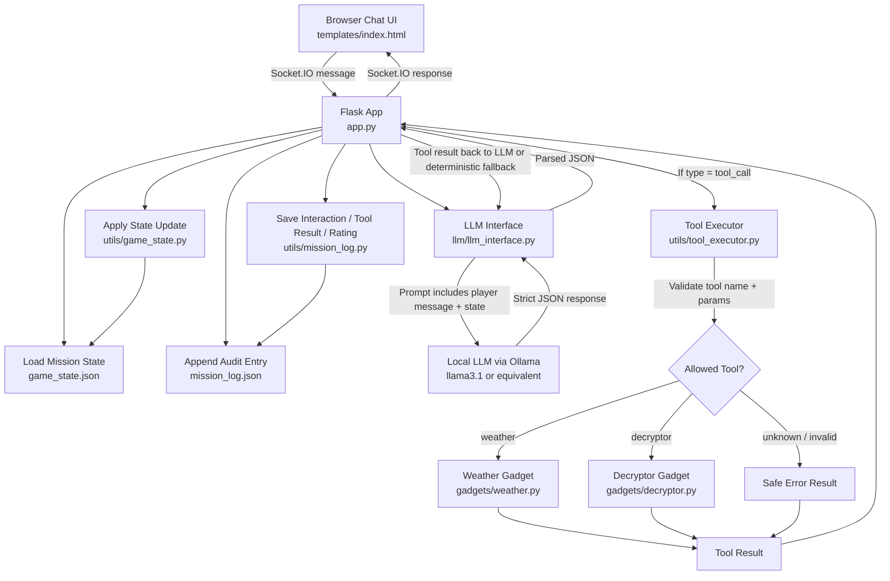
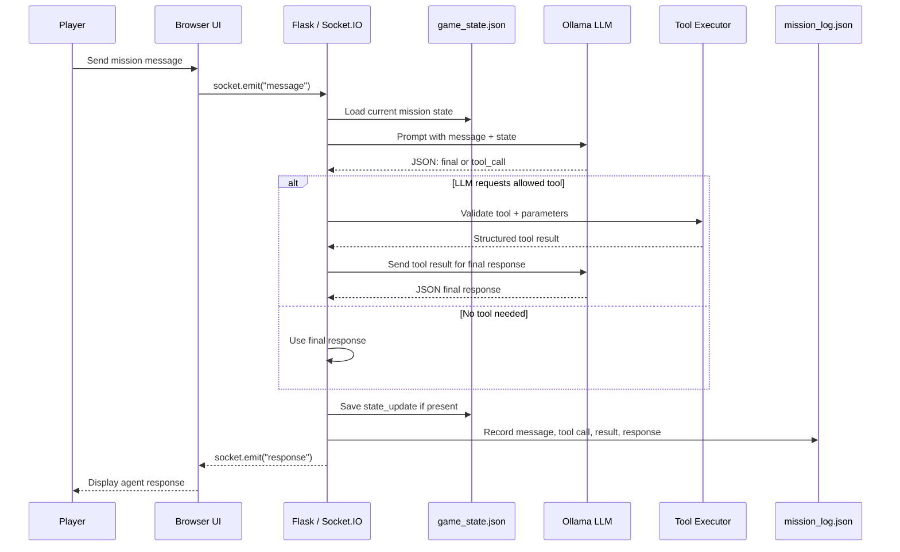

# Secret Agents — LLM-Powered Interactive Game

**Secret Agents** is a small web-based spy game that demonstrates the core architecture of a practical agentic application. A player interacts through a browser chat UI, while a Flask backend coordinates mission state, tool calls, LLM responses, and an audit log.

This is **not just a chatbot**. The LLM acts as a mission controller inside a bounded software loop. It can decide that a tool is needed, but Python validates the request, executes only known tools, persists state, and records what happened.

---

## What It Demonstrates

Secret Agents is a toy spy game wrapped around a serious software pattern:

```markdown
Player message
-> Flask / Socket.IO
-> load game_state.json
-> LLM JSON protocol
-> optional tool call
-> Python tool validation/execution
-> state update
-> mission_log.json audit trail
-> browser response
```

The project demonstrates:

- **LLM as planner/controller** — the model helps decide the next mission action.
- **Python as bounded executor** — the backend validates and executes tools safely.
- **JSON as protocol** — the LLM must return parseable responses instead of vague natural language.
- **Tools/gadgets as controlled capabilities** — weather and Caesar cipher tools are explicitly exposed.
- **Game state as source of truth** — mission progress is stored outside the LLM.
- **Mission log as audit trail** — messages, tool calls, results, and feedback are inspectable.
- **Ratings as lightweight evaluation data** — player feedback can be used to review and improve agent behavior.

The spy theme is intentionally small. The real lesson is how to build an LLM app where the model can coordinate a workflow without owning unsafe execution.

---

## Real-World Utility

The same architecture can be used beyond games.

| Secret Agents Pattern | Real-World Equivalent |
|---|---|
| Mission phases | Workflow stages |
| Weather gadget | External API/tool call |
| Decryptor gadget | Bounded utility function |
| Mission state | Ticket/case/task state |
| Mission log | Audit trail / evaluation log |
| Rating dropdown | Human feedback signal |

Potential applications:

- **Customer support workflow assistant** — guide a support agent through account checks, policy steps, and resolution paths.
- **Incident response assistant** — coordinate triage, diagnostics, runbook steps, and closure.
- **Internal platform assistant** — help engineers inspect services, docs, deployments, and environment state.
- **Deployment checklist assistant** — track release readiness and call bounded verification tools.
- **Onboarding/training simulator** — guide learners through structured scenarios with feedback.
- **Tool-using AI assistant with guardrails** — expose only approved tools and log every decision.

The useful pattern is:

```markdown
LLM proposes.
Software validates.
Tools execute.
State persists.
Logs explain.
```

---

## Architecture

## Architecture Diagram



### Agentic Control Boundary




```markdown
┌────────────────────┐
│ Browser Chat UI    │
│ templates/index.html
└─────────┬──────────┘
          │ Socket.IO
          ▼
┌────────────────────┐
│ Flask App          │
│ app.py             │
│ - receives message │
│ - routes mission   │
│ - emits response   │
└─────────┬──────────┘
          │
          ├───────────────┐
          ▼               ▼
┌────────────────┐   ┌─────────────────┐
│ game_state.json│   │ mission_log.json │
│ source of truth│   │ audit trail      │
└────────────────┘   └─────────────────┘
          │
          ▼
┌────────────────────┐
│ LLM Interface      │
│ llm/llm_interface.py
│ - builds prompt    │
│ - calls Ollama     │
│ - parses JSON      │
└─────────┬──────────┘
          │ tool_call JSON
          ▼
┌────────────────────┐
│ Tool Executor      │
│ utils/tool_executor.py
│ - validates tool   │
│ - validates params │
│ - blocks unknowns  │
└─────────┬──────────┘
          │
          ▼
┌────────────────────┐
│ Gadgets            │
│ weather.py         │
│ decryptor.py       │
└────────────────────┘
```

### Main Agent Loop

1. Player sends a message through the browser.
2. Flask receives it through Socket.IO.
3. Flask loads the current mission state.
4. The LLM receives the message and state.
5. The LLM returns strict JSON.
6. If the JSON requests a tool, Python validates and executes the tool.
7. Tool result is used to generate a final response.
8. State updates are saved to `game_state.json`.
9. The interaction is recorded in `mission_log.json`.
10. Flask emits the final response to the browser.

---

## Requirements

- Python 3.10+ or 3.11+
- `pip`
- `venv`
- Browser
- Ollama for local LLM use
- A local model such as `llama3.1`

The app can still demonstrate deterministic fallback behavior if the LLM is unavailable, but the intended setup uses Ollama.

---

## Setup Instructions

### Linux / macOS

From the folder where you unzipped or cloned the project:

```bash
cd secret_agents/src

python -m venv .venv
source .venv/bin/activate

pip install -r requirements.txt
```

Install and start Ollama if it is not already running:

```bash
ollama serve
```

In another terminal:

```bash
ollama pull llama3.1
ollama list
```

Run the app:

```bash
python app.py
```

Open:

```markdown
http://localhost:8080
```

---

### Windows PowerShell

From the folder where you unzipped or cloned the project:

```powershell
cd secret_agents\src

python -m venv .venv
.\.venv\Scripts\Activate.ps1

pip install -r requirements.txt
```

Install and start Ollama using the Windows installer from Ollama's website. Then pull the model:

```powershell
ollama pull llama3.1
ollama list
```

Run the app:

```powershell
python app.py
```

Open:

```markdown
http://localhost:8080
```

If PowerShell blocks virtual environment activation, run:

```powershell
Set-ExecutionPolicy -ExecutionPolicy RemoteSigned -Scope CurrentUser
```

Then activate the environment again.

---

## Running the App

From `secret_agents/src`:

```bash
python app.py
```

Then open:

```markdown
http://localhost:8080
```

Use the chat box to play the mission.

---

## Demo Script

Use this sequence for a clean Phase 2 demo:

```markdown
Start new mission
Where am I going?
Check the weather before I choose a disguise.
I will pack sunglasses and a light jacket.
Decode the intercepted message
Mission complete. The package was recovered.
```

### 1. Start new mission

Player:

```markdown
Start new mission
```

Expected behavior:

- Mission state is reset or initialized.
- The agent introduces the operation.
- The mission begins in the briefing phase.

What to explain:

> This initializes persistent state. The app is not relying only on chat memory.

---

### 2. Ask destination

Player:

```markdown
Where am I going?
```

Expected behavior:

- Agent identifies the destination.
- Agent points the player toward checking weather.

What to explain:

> The destination comes from `game_state.json`. The agent uses application state.

---

### 3. Check weather

Player:

```markdown
Check the weather before I choose a disguise.
```

Expected behavior:

- Weather tool runs for the mission city.
- Agent recommends a disguise based on weather.
- Mission phase advances.

What to explain:

> This is the key tool-using moment. The LLM can request a tool, but Python validates and executes it.

---

### 4. Confirm disguise

Player:

```markdown
I will pack sunglasses and a light jacket.
```

Expected behavior:

- Disguise is saved.
- Intercepted Caesar cipher message is presented.

What to explain:

> The app tracks workflow progress. It is not just responding conversationally.

---

### 5. Decode intercepted message

Player:

```markdown
Decode the intercepted message
```

Expected behavior:

- Decryptor tool runs using the mission ciphertext and shift.
- Agent reports the decoded message or confirms decoding.
- Mission phase advances to decoded.

What to explain:

> The player does not need to repeat the ciphertext. The tool parameters come from mission state.

---

### 6. Complete mission

Player:

```markdown
Mission complete. The package was recovered.
```

Expected behavior:

- Mission closes.
- `game_state.json` marks the mission complete.

What to explain:

> This demonstrates a terminal workflow state, similar to closing a ticket or incident.

---

## Showing Ratings / Feedback

After an agent response, select a rating in the UI and submit it.

The rating is optional. It does not control mission progress.

It demonstrates a simple feedback hook:

```markdown
agent response
-> human rating
-> mission_log.json
-> later review/evaluation
```

To inspect ratings:

```bash
cat mission_log.json | python -m json.tool
```

Look for rating entries, often under a `ratings` list or as log entries depending on implementation.

What to say during a demo:

> Ratings are lightweight human feedback. In a real system, they could become an evaluation dataset showing which responses were useful, where the agent got stuck, and which tool flows need improvement.

---

## Inspecting State and Logs

### Linux / macOS

```bash
cat game_state.json | python -m json.tool
cat mission_log.json | python -m json.tool
```

### Windows PowerShell

```powershell
Get-Content game_state.json | python -m json.tool
Get-Content mission_log.json | python -m json.tool
```

### What These Files Mean

`game_state.json` is the source of truth for mission progress.

It may include:

- mission ID
- active/completed status
- mission phase
- destination
- city
- weather summary
- disguise
- ciphertext
- cipher shift
- decoded message
- objective

`mission_log.json` is the audit trail.

It may include:

- player messages
- LLM responses
- tool requests
- tool results
- final responses
- ratings
- errors or fallback behavior

This makes the agent inspectable and debuggable.

---

## Running Tests

From `secret_agents/src`:

```bash
python -m compileall .
python tests/smoke_phase1.py
python tests/smoke_phase2.py
python -m json.tool game_state.json
python -m json.tool mission_log.json
```

Passing tests should show that:

- Python files compile.
- Phase 1 tools work.
- Phase 2 mission flow works.
- JSON files are valid.

---

## LLM Protocol

The project expects the LLM to return strict JSON.

### Final response

```json
{
  "type": "final",
  "message": "Player-facing mission response here."
}
```

### Tool call

```json
{
  "type": "tool_call",
  "tool": "weather",
  "parameters": {
    "city": "Paris"
  },
  "reason": "The player needs weather data before choosing a disguise."
}
```

### Final response with state update

```json
{
  "type": "final",
  "message": "Mission phase updated.",
  "state_update": {
    "mission_phase": "weather_checked"
  }
}
```

Strict JSON matters because the backend needs to parse and validate model output. The model is not allowed to execute tools directly. It can only request tool execution through the protocol.

---

## Available Tools / Gadgets

### Weather

Purpose:

```markdown
Get simple weather information for a city.
```

Example tool-call JSON:

```json
{
  "type": "tool_call",
  "tool": "weather",
  "parameters": {
    "city": "Paris"
  },
  "reason": "Weather is needed before choosing a disguise."
}
```

Expected backend behavior:

- Validate `city`.
- Run the weather gadget.
- Return a structured result.
- Log the tool call and result.

---

### Decryptor

Purpose:

```markdown
Decode a Caesar cipher message.
```

Example tool-call JSON:

```json
{
  "type": "tool_call",
  "tool": "decryptor",
  "parameters": {
    "ciphertext": "KHOOR",
    "shift": 3
  },
  "reason": "The player wants to decode the intercepted message."
}
```

Expected backend behavior:

- Validate `ciphertext`.
- Validate `shift`.
- Run the decryptor gadget.
- Return decoded text.
- Log the tool call and result.

---

## Troubleshooting

### Flask is not installed

Symptom:

```markdown
ModuleNotFoundError: No module named 'flask'
```

Fix:

```bash
source .venv/bin/activate
pip install -r requirements.txt
```

On Windows:

```powershell
.\.venv\Scripts\Activate.ps1
pip install -r requirements.txt
```

---

### Port already in use

Symptom:

```markdown
Address already in use
```

Fix: stop the other process or change the port in `app.py`.

On Linux/macOS, find the process:

```bash
lsof -i :8080
```

---

### Ollama is not running

Symptom:

```markdown
Connection refused
```

Fix:

```bash
ollama serve
```

Then in another terminal:

```bash
ollama list
```

---

### Model not found

Symptom:

```markdown
model 'llama3.1' not found
```

Fix:

```bash
ollama pull llama3.1
```

Or update the model name in `llm/llm_interface.py` to match a model from:

```bash
ollama list
```

---

### LLM returns malformed JSON

Symptom:

- The app gives a fallback message.
- Terminal logs JSON parsing errors.
- The model responds in natural language instead of JSON.

Fixes:

- Use a better local model.
- Lower model temperature.
- Check the system prompt in `llm_interface.py`.
- Keep deterministic fallbacks enabled for demo stability.

---

### App hangs or gives fallback response

Check:

```bash
cat mission_log.json | python -m json.tool
```

Look for:

- malformed LLM responses
- unknown tool names
- missing parameters
- repeated tool calls
- failed final response generation

Restart the app after code changes:

```bash
python app.py
```

---

### Weather/disguise routing confusion

Symptom:

```markdown
Check the weather before I choose a disguise.
```

gets interpreted as choosing a disguise.

Fix:

- Weather/decode routing should run before disguise-selection routing.
- Specific command detection should happen before broad keyword matching.
- Add regression tests for phrases that contain multiple intent keywords.

---

### JSON files invalid

Symptom:

```markdown
json.decoder.JSONDecodeError
```

Fix:

```bash
python -m json.tool game_state.json
python -m json.tool mission_log.json
```

If needed, reset `mission_log.json` to:

```json
{
  "conversation": [],
  "ratings": []
}
```

Reset `game_state.json` using the app's start mission command or the helper function in `utils/game_state.py`.

---

## Scope and Non-Goals

This project intentionally stays small.

It does **not** include:

- database
- authentication
- production deployment
- user accounts
- arbitrary tool execution
- unrestricted agent autonomy
- multiple mission campaigns
- real weather API keys by default
- complex policy engine

The goal is to demonstrate the architecture clearly, not to build a full game platform.

---

## Future Improvements

Possible extensions:

- Add more gadgets:
  - translator
  - timezone converter
  - clue lookup
  - code-name generator
- Add structured UI buttons for suggested actions.
- Add more missions.
- Add a real weather API after the fake weather tool is stable.
- Build a small evaluation dashboard from ratings.
- Add stronger guardrails around unsupported requests.
- Add regression tests for full mission transcripts.
- Add a reset button in the UI.
- Add better visualization of mission phase and state.

---

## Key Takeaway

Secret Agents demonstrates the minimum practical shape of an agentic application:

```markdown
The LLM plans.
Python validates and executes.
JSON defines the protocol.
State makes progress durable.
Logs make behavior inspectable.
Feedback creates evaluation data.
```

The spy game is small, but the pattern scales to useful systems: support workflows, incident response, deployment checklists, onboarding assistants, internal platform tools, and governed automation.
