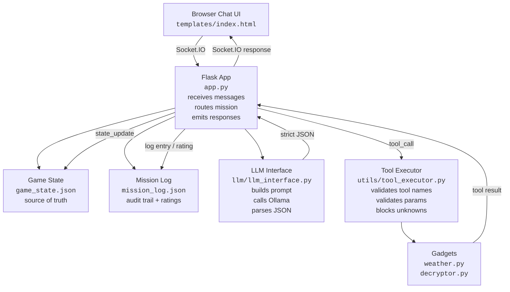
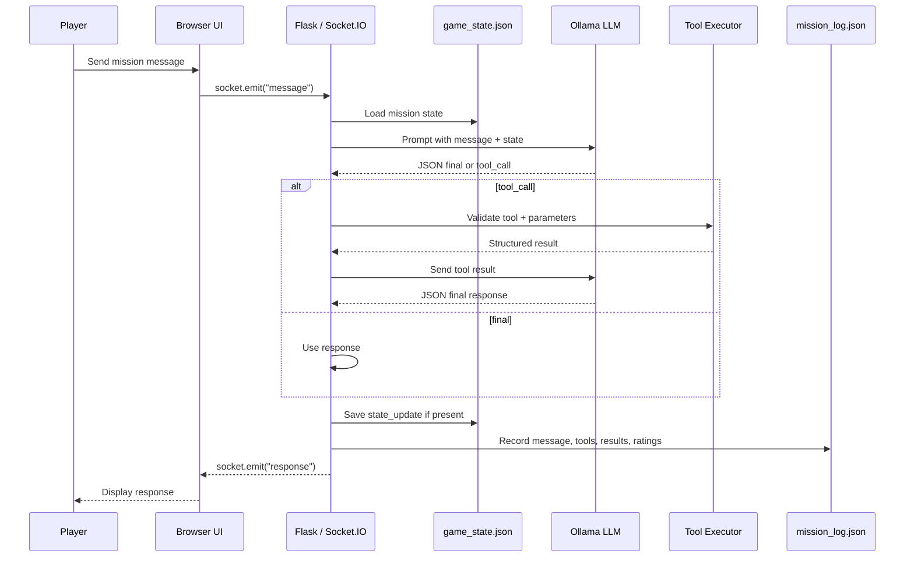

# Secret Agents — LLM-Powered Interactive Game

---

## Table of Contents

- [Summary](#summary)
- [Why This Matters](#why-this-matters)
- [Real-World Utility](#real-world-utility)
- [Architecture](#architecture)
  - [System Architecture](#system-architecture)
  - [Agent Control Flow](#agent-control-flow)
- [Repository Layout](#repository-layout)
- [Requirements](#requirements)
- [Setup](#setup)
  - [Linux / macOS](#linux--macos)
  - [Windows PowerShell](#windows-powershell)
- [Run the App](#run-the-app)
- [Demo Script](#demo-script)
- [Inspect State, Logs, and Ratings](#inspect-state-logs-and-ratings)
- [LLM Protocol](#llm-protocol)
- [Tools](#tools)
- [Tests](#tests)
- [Troubleshooting](#troubleshooting)
- [Scope / Non-Goals](#scope--non-goals)
- [Future Improvements](#future-improvements)
- [Key Takeaway](#key-takeaway)

## Summary

**Secret Agents** is a small Flask-based spy game that demonstrates practical agentic application architecture. A player chats with Mission Control in the browser, while an LLM coordinates the mission through a strict JSON protocol.

The key design boundary is simple:

```text
LLM = planner/controller
Python = validator/executor
JSON = protocol
game_state.json = source of truth
mission_log.json = audit trail
ratings = lightweight evaluation data
```

This is not just a chatbot. The model can decide that a tool is needed, but Python validates the request, executes only known tools, persists mission state, and records what happened.

---

## Why This Matters

Secret Agents demonstrates the minimum useful shape of a bounded agentic system:

```text
Player message
-> Flask / Socket.IO
-> load mission state
-> LLM JSON response
-> optional Python tool call
-> state update
-> audit log
-> browser response
```

The spy-game theme is intentionally small. The practical lesson is how to let an LLM coordinate a workflow without giving it uncontrolled execution authority.

---

## Real-World Utility

The same pattern can support:

- **Customer support workflow assistants** — guide agents through account checks, policies, and resolution steps.
- **Incident response assistants** — coordinate triage, diagnostics, runbook steps, and closure.
- **Deployment checklist assistants** — track release readiness and bounded verification steps.
- **Onboarding/training simulators** — move learners through structured scenarios with feedback.
- **Internal platform assistants** — expose approved tools while preserving validation, state, and logs.

Useful pattern:

```text
LLM proposes.
Software validates.
Tools execute.
State persists.
Logs explain.
```

---

## Architecture

### System Architecture



### Agent Control Flow



---

## Repository Layout

```text
secret-agents/
├── README.md
└── src/
    ├── app.py
    ├── requirements.txt
    ├── game_state.json
    ├── mission_log.json
    ├── templates/
    ├── gadgets/
    ├── llm/
    ├── utils/
    └── tests/
```

---

## Requirements

- Python 3.10+
- [`uv`](https://docs.astral.sh/uv/) for Python environment/dependency management
- Browser
- Ollama for local LLM use
- A local model such as `llama3.1`

The deterministic routing/fallbacks keep the demo stable, but the intended setup uses Ollama.

---

## Setup

This project works with the existing `requirements.txt`; no code changes are required for `uv`.

### Install `uv`

Linux / macOS:

```bash
curl -LsSf https://astral.sh/uv/install.sh | sh
```

Windows PowerShell:

```powershell
powershell -ExecutionPolicy ByPass -c "irm https://astral.sh/uv/install.ps1 | iex"
```

After installation, open a new terminal or reload your shell.

### Linux / macOS

```bash
cd <repo-folder>/src

uv venv
source .venv/bin/activate

uv pip install -r requirements.txt
```

Start Ollama in another terminal if it is not already running:

```bash
ollama serve
```

Pull the model:

```bash
ollama pull llama3.1
ollama list
```

### Windows PowerShell

```powershell
cd <repo-folder>\src

uv venv
.\.venv\Scripts\Activate.ps1

uv pip install -r requirements.txt
```

Pull the model:

```powershell
ollama pull llama3.1
ollama list
```

If PowerShell blocks virtual environment activation:

```powershell
Set-ExecutionPolicy -ExecutionPolicy RemoteSigned -Scope CurrentUser
```


---

## Run the App

From `src/`:

```bash
uv run python app.py
```

Or, if your virtual environment is already activated:

```bash
python app.py
```

Open:

```text
http://localhost:8080
```


---

## Demo Script

Use this sequence for a clean Phase 2 demo:

```text
Start new mission
Where am I going?
Check the weather before I choose a disguise.
I will pack sunglasses and a light jacket.
Decode the intercepted message
Mission complete. The package was recovered.
```

Expected flow:

1. **Start new mission** — initializes persistent mission state.
2. **Where am I going?** — reads destination from `game_state.json`.
3. **Check the weather...** — runs the weather gadget and recommends a disguise.
4. **I will pack...** — stores disguise and presents the cipher challenge.
5. **Decode the intercepted message** — runs the decryptor using mission state.
6. **Mission complete...** — closes the mission and saves completion state.

This demo shows stateful workflow progress, bounded tool use, and inspectable logs.

---

## Inspect State, Logs, and Ratings

### Linux / macOS

```bash
cat game_state.json | python -m json.tool
cat mission_log.json | python -m json.tool
```

### Windows PowerShell

```powershell
Get-Content game_state.json | python -m json.tool
Get-Content mission_log.json | python -m json.tool
```

`game_state.json` stores the source of truth for mission progress, including phase, destination, disguise, cipher data, and completion status.

`mission_log.json` stores the audit trail: player messages, LLM responses, tool calls, tool results, final responses, and optional ratings.

To show ratings during a demo, submit a rating in the UI after an agent response, then inspect `mission_log.json`.

---

## LLM Protocol

The LLM must return strict JSON.

### Final response

```json
{
  "type": "final",
  "message": "Player-facing mission response here."
}
```

### Tool call

```json
{
  "type": "tool_call",
  "tool": "weather",
  "parameters": {
    "city": "Paris"
  },
  "reason": "Weather is needed before choosing a disguise."
}
```

### Final response with state update

```json
{
  "type": "final",
  "message": "Mission phase updated.",
  "state_update": {
    "mission_phase": "weather_checked"
  }
}
```

The model requests actions through JSON. Python decides whether the request is valid and safe to execute.

---

## Tools

### Weather

Gets simple weather information for a city.

```json
{
  "type": "tool_call",
  "tool": "weather",
  "parameters": {
    "city": "Paris"
  }
}
```

### Decryptor

Decodes a Caesar cipher message.

```json
{
  "type": "tool_call",
  "tool": "decryptor",
  "parameters": {
    "ciphertext": "KHOOR",
    "shift": 3
  }
}
```

Unknown tools and missing parameters return safe error results instead of executing arbitrary behavior.

---

## Tests

From `src/`:

```bash
uv run python -m compileall .
uv run python tests/smoke_phase1.py
uv run python tests/smoke_phase2.py
uv run python -m json.tool game_state.json
uv run python -m json.tool mission_log.json
```

If your virtual environment is already activated, `python ...` works too.


---

## Troubleshooting

### Dependencies missing

```bash
uv pip install -r requirements.txt
```

If you have not created the environment yet:

```bash
uv venv
source .venv/bin/activate
uv pip install -r requirements.txt
```

Windows:

```powershell
uv venv
.\.venv\Scripts\Activate.ps1
uv pip install -r requirements.txt
```

### Ollama is not running

```bash
ollama serve
ollama list
```

### Model not found

```bash
ollama pull llama3.1
```

Or update the model name in `llm/llm_interface.py` to match a model from:

```bash
ollama list
```

### Port already in use

The app uses:

```text
http://localhost:8080
```

Stop the process using the port, or change the port in `app.py`.

Linux/macOS helper:

```bash
lsof -i :8080
```

### Malformed JSON or fallback response

If the LLM returns natural language instead of JSON, the app may use a fallback response. Check:

```bash
cat mission_log.json | python -m json.tool
```

Then verify:

- Ollama is running.
- The model name is correct.
- The system prompt in `llm/llm_interface.py` still requires JSON.
- Deterministic fallback routing is enabled.

---

## Scope / Non-Goals

This project intentionally does not include:

- database
- authentication
- production deployment
- arbitrary tool execution
- unrestricted agent autonomy
- multiple mission campaigns
- complex policy engine

The goal is to demonstrate the architecture clearly, not to build a full game platform.

---

## Future Improvements

- Add more bounded gadgets.
- Add structured UI action buttons.
- Add more missions.
- Add a real weather API.
- Add a ratings/evaluation dashboard.
- Add regression tests for full mission transcripts.
- Add a visible mission-state panel in the UI.

---

## Key Takeaway

Secret Agents demonstrates a practical agentic software pattern:

```text
The LLM plans.
Python validates and executes.
JSON defines the protocol.
State makes progress durable.
Logs make behavior inspectable.
Feedback creates evaluation data.
```

The game is small, but the architecture scales to support workflows, incident response, and deployment checklists.
